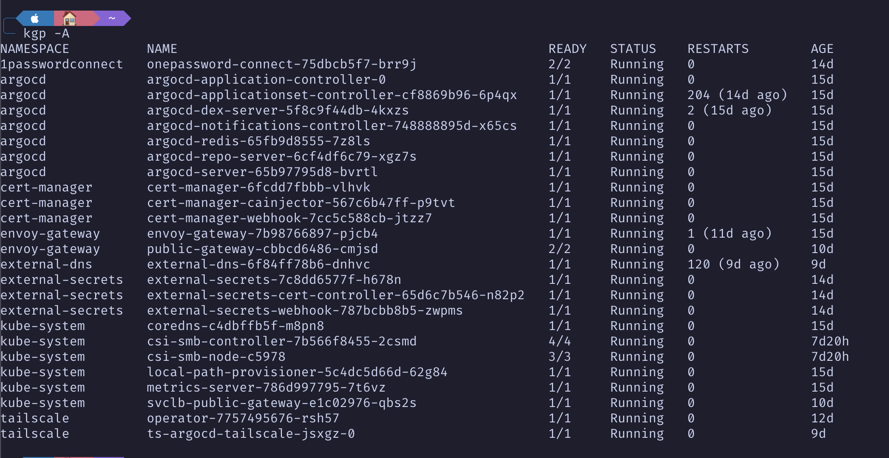

# Argo

The configuration within this folder, relates to the declarative Kubernetes configuration that is used by [ArgoCD](https://argo-cd.readthedocs.io/en/stable/)

*This repo is subject to change, as it is active development* 

## Setup

First you will need the following:

- 1Password
- A Cloudflare Account with a Domain setup.
- A Server with Kubernetes already installed.

### 1Password Credentials

- Create a vault called `homelab` or an existing vault.
- Follow https://developer.1password.com/docs/connect/get-started/#step-1-set-up-a-secrets-automation-workflow 1Password.com tab for generating 1password-credentials.json and save into bootstrap directory.
- Follow https://developer.1password.com/docs/connect/get-started/#step-1-set-up-a-secrets-automation-workflow 1Password CLI tab for generating a 1password connect token and save as 1password-token.secret in bootstrap directory.

### External DNS & Cloudflare

- In the homelab vault, create a secret called `cf-dns`
- Follow https://developers.cloudflare.com/fundamentals/api/get-started/create-token/ for generating a token and save into key named cloudflare-token

### Certificates

Cert Manager CRDs (Need ClusterIssuer)
- https://github.com/cert-manager/cert-manager/releases/latest/download/cert-manager.crds.yaml

### Secrets

```shell
kubectl create secret generic 1passwordconnect --namespace external-secrets --from-literal token=$<token-secret>
```

## Installation

Current stable deployment is as per the below:
*Note the below image has the service loadbalancer deployed, which will be required as part of the initial install of K3s, as per the command below the image will install if used*


```shell
curl -fL https://get.k3s.io | INSTALL_K3S_CHANNEL=latest sh -s - server --cluster-init --kube-apiserver-arg default-not-ready-toleration-seconds=10 --kube-apiserver-arg default-unreachable-toleration-seconds=10 --disable=traefik,local-storage
```

## Requirements

Gateway-Api:

```shell
kubectl apply -f https://raw.githubusercontent.com/kubernetes-sigs/gateway-api/refs/heads/main/config/crd/standard/gateway.networking.k8s.io_gatewayclasses.yaml \
  -f https://raw.githubusercontent.com/kubernetes-sigs/gateway-api/refs/heads/main/config/crd/standard/gateway.networking.k8s.io_gateways.yaml \
  -f https://raw.githubusercontent.com/kubernetes-sigs/gateway-api/refs/heads/main/config/crd/standard/gateway.networking.k8s.io_grpcroutes.yaml \
  -f https://raw.githubusercontent.com/kubernetes-sigs/gateway-api/refs/heads/main/config/crd/standard/gateway.networking.k8s.io_httproutes.yaml \
  -f https://raw.githubusercontent.com/kubernetes-sigs/gateway-api/refs/heads/main/config/crd/standard/gateway.networking.k8s.io_referencegrants.yaml \
  -f https://raw.githubusercontent.com/kubernetes-sigs/gateway-api/v1.2.0/config/crd/experimental/gateway.networking.k8s.io_tlsroutes.yaml
```

Envoy Proxy:

*applying the below will cause errors for trying to install experimental crds when normal crds are installed* 

```shell
kubectl apply -f https://raw.githubusercontent.com/envoyproxy/gateway/refs/heads/main/charts/gateway-helm/charts/crds/crds/generated/gateway.envoyproxy.io_envoyproxies.yaml --server-side
```

This will require additional installation of crds from a release, which is below:
```shell
kubectl apply --server-side -f https://github.com/envoyproxy/gateway/releases/download/v1.7.2/install.yaml
```


Now its installed, it will create and deploy an additional namespace called `envoy-gateway-system` which will need to be delete and the existing install restarted. By doing this it will re-allocate the `lease` that is being used by envoy-gateway.
```shell
kubectl delete namespace envoy-gateway-system
kubectl rollout restart deployment/envoy-gateway -n envoy-gateway
```

Cert-Manager: 

For cert-manager go onto the official release version and copy the link to the cert-manager.crds.yaml file and then apply that file.

```shell
kubectl apply -f <cert-manager.crds.yaml from releases>
```

### Base Configuration

```shell
curl -fL https://get.k3s.io | INSTALL_K3S_CHANNEL=latest sh -s - server --cluster-init --kube-apiserver-arg default-not-ready-toleration-seconds=10 --kube-apiserver-arg default-unreachable-toleration-seconds=10 --disable=servicelb,traefik 

#### Secrets

1password cli is required for secret setup. to do this install the 1password cli from the following URL: https://developer.1password.com/docs/cli/get-started

Secrets below need to be updated / obtained from 1password. In order to do this the following command needs to be ran locally in order to sign into the 1password cli `eval $(op signin)`. 

```Shell
login via `eval $(op signin)`

export domain="$(op read op://homelab/stringreplacesecret/domain)" / Powershell example "$env:DOMAIN = & op read "op://homelab/stringreplacesecret/domain" "
export onepasswordconnect_json="$(op read op://homelab/1passwordconnect/1password-credentials.json)"
export externalsecrets_token="$(op read op://homelab/external-secrets/token)"

kubectl create namespace 1passwordconnect
kubectl create secret generic 1passwordconnect --namespace 1passwordconnect --from-literal 1password-credentials.json="$onepasswordconnect_json"

kubectl create namespace external-secrets
kubectl create secret generic 1passwordconnect --namespace external-secrets --from-literal token=$externalsecrets_token

kubectl create namespace argocd
```

### ArgoCD

Create namespace for ArgoCD and install the default configuration into the ArgoCD namespace

```shell
export argocd_applicationyaml=$(curl -sL "https://raw.githubusercontent.com/mattkgwhite/home-ops/main/kubernetes/argo/manifests/argocd.yaml" | yq eval-all '. | select(.metadata.name == "argocd" and .kind == "Application")' -)
export argocd_name=$(echo "$argocd_applicationyaml" | yq eval '.metadata.name' -)
export argocd_chart=$(echo "$argocd_applicationyaml" | yq eval '.spec.source.chart' -)
export argocd_repo=$(echo "$argocd_applicationyaml" | yq eval '.spec.source.repoURL' -)
export argocd_namespace=$(echo "$argocd_applicationyaml" | yq eval '.spec.destination.namespace' -)
export argocd_version=$(echo "$argocd_applicationyaml" | yq eval '.spec.source.targetRevision' -)
export argocd_values=$(echo "$argocd_applicationyaml" | yq eval '.spec.source.helm.valuesObject' - | yq eval 'del(.configs.cm)' -)
export argocd_config=$(curl -sL "https://raw.githubusercontent.com/mattkgwhite/home-ops/main/kubernetes/argo/manifests/argocd.yaml" | yq eval-all '. | select(.kind == "AppProject" or .kind == "ApplicationSet")' -)

# install
echo "$argocd_values" | helm template $argocd_name $argocd_chart --repo $argocd_repo --version $argocd_version --namespace $argocd_namespace --values - | kubectl apply --namespace $argocd_namespace --filename -

# configure
echo "$argocd_config" | kubectl apply --filename -
```

### CRDs

- [Gateway](https://github.com/kubernetes-sigs/gateway-api/tree/main/config/crd/standard)
```shell 
kubectl apply -f https://raw.githubusercontent.com/kubernetes-sigs/gateway-api/refs/heads/main/config/crd/standard/gateway.networking.k8s.io_backendtlspolicies.yaml \
-f https://raw.githubusercontent.com/kubernetes-sigs/gateway-api/refs/heads/main/config/crd/standard/gateway.networking.k8s.io_gatewayclasses.yaml \
-f https://raw.githubusercontent.com/kubernetes-sigs/gateway-api/refs/heads/main/config/crd/standard/gateway.networking.k8s.io_gateways.yaml \
-f https://raw.githubusercontent.com/kubernetes-sigs/gateway-api/refs/heads/main/config/crd/standard/gateway.networking.k8s.io_grpcroutes.yaml \
-f https://raw.githubusercontent.com/kubernetes-sigs/gateway-api/refs/heads/main/config/crd/standard/gateway.networking.k8s.io_httproutes.yaml \
-f https://raw.githubusercontent.com/kubernetes-sigs/gateway-api/refs/heads/main/config/crd/standard/gateway.networking.k8s.io_listenersets.yaml \
-f https://raw.githubusercontent.com/kubernetes-sigs/gateway-api/refs/heads/main/config/crd/standard/gateway.networking.k8s.io_referencegrants.yaml \
-f https://raw.githubusercontent.com/kubernetes-sigs/gateway-api/v1.2.0/config/crd/experimental/gateway.networking.k8s.io_tlsroutes.yaml \
-f https://raw.githubusercontent.com/kubernetes-sigs/gateway-api/refs/heads/main/config/crd/standard/gateway.networking.k8s.io_vap_safeupgrades.yaml
```

- [External Secret](https://github.com/external-secrets/external-secrets/tree/main/config/crds/bases)
```shell
kubectl apply -f https://raw.githubusercontent.com/external-secrets/external-secrets/refs/heads/main/config/crds/bases/external-secrets.io_clusterexternalsecrets.yaml \
  -f https://raw.githubusercontent.com/external-secrets/external-secrets/refs/heads/main/config/crds/bases/external-secrets.io_clusterpushsecrets.yaml \
  -f https://raw.githubusercontent.com/external-secrets/external-secrets/refs/heads/main/config/crds/bases/external-secrets.io_clustersecretstores.yaml --server-side \
  -f https://raw.githubusercontent.com/external-secrets/external-secrets/refs/heads/main/config/crds/bases/external-secrets.io_externalsecrets.yaml \
  -f https://raw.githubusercontent.com/external-secrets/external-secrets/refs/heads/main/config/crds/bases/external-secrets.io_pushsecrets.yaml \
  -f https://raw.githubusercontent.com/external-secrets/external-secrets/refs/heads/main/config/crds/bases/external-secrets.io_secretstores.yaml --server-side\
  -f https://raw.githubusercontent.com/external-secrets/external-secrets/refs/heads/main/config/crds/bases/generators.external-secrets.io_acraccesstokens.yaml \
  -f https://raw.githubusercontent.com/external-secrets/external-secrets/refs/heads/main/config/crds/bases/generators.external-secrets.io_cloudsmithaccesstokens.yaml \
  -f https://raw.githubusercontent.com/external-secrets/external-secrets/refs/heads/main/config/crds/bases/generators.external-secrets.io_clustergenerators.yaml \
  -f https://raw.githubusercontent.com/external-secrets/external-secrets/refs/heads/main/config/crds/bases/generators.external-secrets.io_ecrauthorizationtokens.yaml \
  -f https://raw.githubusercontent.com/external-secrets/external-secrets/refs/heads/main/config/crds/bases/generators.external-secrets.io_fakes.yaml \
  -f https://raw.githubusercontent.com/external-secrets/external-secrets/refs/heads/main/config/crds/bases/generators.external-secrets.io_gcraccesstokens.yaml \
  -f https://raw.githubusercontent.com/external-secrets/external-secrets/refs/heads/main/config/crds/bases/generators.external-secrets.io_generatorstates.yaml \
  -f https://raw.githubusercontent.com/external-secrets/external-secrets/refs/heads/main/config/crds/bases/generators.external-secrets.io_githubaccesstokens.yaml \
  -f https://raw.githubusercontent.com/external-secrets/external-secrets/refs/heads/main/config/crds/bases/generators.external-secrets.io_grafanas.yaml \
  -f https://raw.githubusercontent.com/external-secrets/external-secrets/refs/heads/main/config/crds/bases/generators.external-secrets.io_mfas.yaml \
  -f https://raw.githubusercontent.com/external-secrets/external-secrets/refs/heads/main/config/crds/bases/generators.external-secrets.io_passwords.yaml \
  -f https://raw.githubusercontent.com/external-secrets/external-secrets/refs/heads/main/config/crds/bases/generators.external-secrets.io_quayaccesstokens.yaml \
  -f https://raw.githubusercontent.com/external-secrets/external-secrets/refs/heads/main/config/crds/bases/generators.external-secrets.io_sshkeys.yaml \
  -f https://raw.githubusercontent.com/external-secrets/external-secrets/refs/heads/main/config/crds/bases/generators.external-secrets.io_stssessiontokens.yaml \
  -f https://raw.githubusercontent.com/external-secrets/external-secrets/refs/heads/main/config/crds/bases/generators.external-secrets.io_uuids.yaml \
  -f https://raw.githubusercontent.com/external-secrets/external-secrets/refs/heads/main/config/crds/bases/generators.external-secrets.io_vaultdynamicsecrets.yaml \
  -f https://raw.githubusercontent.com/external-secrets/external-secrets/refs/heads/main/config/crds/bases/generators.external-secrets.io_webhooks.yaml
``` 

- Cert-Manager
```shell
kubectl apply -f https://github.com/cert-manager/cert-manager/releases/download/v1.20.2/cert-manager.crds.yaml

-[External-DNS](https://github.com/kubernetes-sigs/external-dns/blob/master/config/crd/standard/dnsendpoints.externaldns.k8s.io.yaml)

```shell
kubectl apply -f https://raw.githubusercontent.com/kubernetes-sigs/external-dns/refs/heads/master/config/crd/standard/dnsendpoints.externaldns.k8s.io.yaml
```

- [ArgoCD]()

```shell
kubectl apply -f https://raw.githubusercontent.com/argoproj/argo-cd/refs/heads/master/manifests/crds/application-crd.yaml \
-f https://raw.githubusercontent.com/argoproj/argo-cd/refs/heads/master/manifests/crds/applicationset-crd.yaml \
-f https://raw.githubusercontent.com/argoproj/argo-cd/refs/heads/master/manifests/crds/appproject-crd.yaml
```

- [Tailscale]()

```shell
kubectl apply -f https://raw.githubusercontent.com/tailscale/tailscale/refs/heads/main/cmd/k8s-operator/deploy/crds/tailscale.com_connectors.yaml \
-f https://raw.githubusercontent.com/tailscale/tailscale/refs/heads/main/cmd/k8s-operator/deploy/crds/tailscale.com_dnsconfigs.yaml \
-f https://raw.githubusercontent.com/tailscale/tailscale/refs/heads/main/cmd/k8s-operator/deploy/crds/tailscale.com_proxyclasses.yaml \
-f https://raw.githubusercontent.com/tailscale/tailscale/refs/heads/main/cmd/k8s-operator/deploy/crds/tailscale.com_proxygrouppolicies.yaml \
-f https://raw.githubusercontent.com/tailscale/tailscale/refs/heads/main/cmd/k8s-operator/deploy/crds/tailscale.com_proxygroups.yaml \
-f https://raw.githubusercontent.com/tailscale/tailscale/refs/heads/main/cmd/k8s-operator/deploy/crds/tailscale.com_recorders.yaml \
-f https://raw.githubusercontent.com/tailscale/tailscale/refs/heads/main/cmd/k8s-operator/deploy/crds/tailscale.com_tailnets.yaml
```

### Utils

- CSI Driver - `sudo apt install cifs-utils`